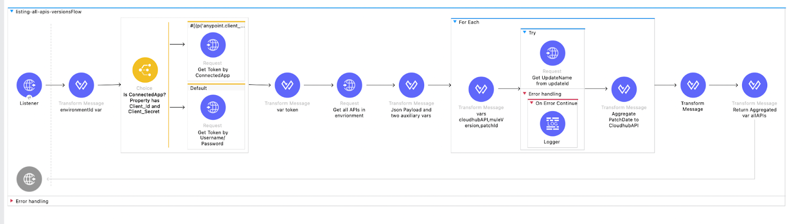

# Disclaimer 
This is not a MuleSoft Product. MuleSoft does not have any responsability over your usage and there is no Support available around it. It's an utility application that helps displaying your Patched dates for applications.

# Why use it? 
Use Case: As a Customer concerned about updating Cloudhub Patches every month I want to get a list of all CloudhubAPIs MRT version with their (Major.Minor.Patch, including Patch Date) in a Dashboard so that I can make decisions and understand if we are GOOD to go, even before the Mandatory Patches are "automatically applied"

# [FIVE (5) Minutes Video](https://www.youtube.com/watch?v=C7ULhoKCdSo)
Topics from the recording: 
1. Mule Runtime Version with Patch Date
2. Cloudhub monthly Patching recap
3. Runtime Manager - List all Applications pending for updates
4. Runtime Manager - Patch date in an Application 
5. PlatformAPIs - Getting the date from a PatchID
6. Using Postman PlatformAPIs to get the date from a PatchID
7. Displaying Mule Version with Patch Date in a Dashboard (Open Source tool)

# What is it? listing-all-apis-versions
Three componentes: 
1. A MuleSoft App to list all Cloudhub APIs for an environment and aggregate the PatchDate, then produces a CSV. You need to add your own Credentials to the Property file

2. Postman Collection to call that MuleApp. You need to add your own Auth Headers (OrgID and EnvID). This returns the CSV

3. GoogleSpreadsheet Dashboard (based on [this GoogleSheet](https://docs.google.com/spreadsheets/d/e/2PACX-1vSjQKjV5Dg8ARWnRWGoAFWtND54imxrefS52oWJxOIYs9QjdfmbDl4RAbxx_DPENgzzHlEzLVfIZUMn/pubhtml)  ), where you paste the CSV and you go to the Dashboards tab to visualize all your APIs patch dates 

# How to use it 
1. Download and import the Jar file into Anypoint Studio. Add your own client_id/client_secret in the properties 
2. Download and import the Postman Collection. Add your own OrganizationID and EnvironmentID in the HTTP Headers. Copy the CSV response 
3. Get a fresh copy of [the public GoogleSheet](https://docs.google.com/spreadsheets/d/e/2PACX-1vSjQKjV5Dg8ARWnRWGoAFWtND54imxrefS52oWJxOIYs9QjdfmbDl4RAbxx_DPENgzzHlEzLVfIZUMn/pubhtml) . Go to Data tab, paste the CSV and use the "Split Text to Columns" (whch splits by Comma)
4. Done. Check your Dashboards view, enjoy! 

# More Context 
1. The Runtime Manager view shows Mule Versions (x.y.z) without the Patch Date (x.y.z PatchDate), unless you go API by API, one by one. You know there are updates pending, but, you want to know if it is patch related 
“Date Modified” includes “Restarts and other updates to the app”. It does not mean last time a Patch was pplied

2. Using Platform APIs you can retrieve CloudhubAPIs, it won’t have the Patch Date; Customer need to make so advanced Loop logic with a MuleAPI or other programming to be able to get a list with all the patch date info. Below in the left, example of what a Customer gets

3. Ideally, when Patch Update is available, you will immediately apply it and run any automated regression tests, without waiting until Mandatory Patch. Realistically, you prefer to plan it, applying it to most important APIs and testing before the automatic update thus having some time in the unlikely scenario there was a bug
